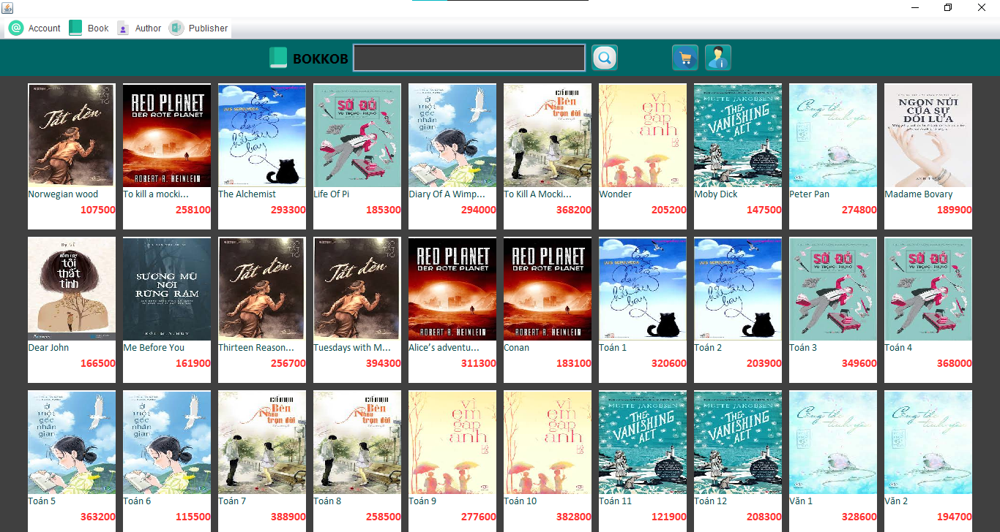
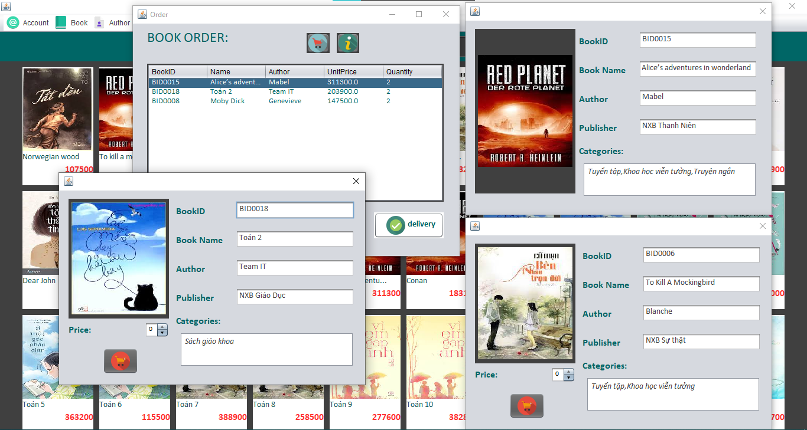

## BOOKSTORE - ứng dụng quản lý cửa hàng sách
#### Bài tập lớn môn Công nghệ phần mềm
* Author: Hoàng Nhật Minh
* Language: Java, MySQL
* Denpendences: 
    * JDK - trình biên dịch java 17 hoặc hơn. 
    * JBDC - MySQL connector (file "mysql-connector-java-8.0.25.jar" đính kèm)

#### Project structure:
* BookStoreManagement: source code chính của project, chứa giao diện được thiết kế theo mô hình MVC.
* Database: chứa thông tin liên quan đến database của project.
* Documentation: chứa tài liệu phân tích thiết kế dự án.
* Các file khác được tạo từ trình IDE IntelliJ có thể khác nhau hoặc không cần thiết với từng loại máy.

#### run project:
* đảm bảo IDE của bạn có thể kết nối MySQL một cách bình thường thông qua JBDC
* tạo database mới bằng source code của file BookStoreManagement.sql
* run BookStoreManagement/Test/Application.java 
* đăng nhập với tài khoản admin, thông tin chi tiết tại file Data.xlsx

#### Project:

